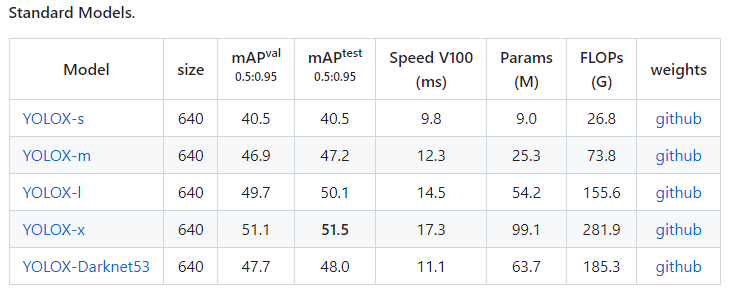

# 22.04.2023
Teams meeting (Mateusz K. + Mateusz W.)  

General Information
-------------------

YOLOX
-----

*   preparing conda environment and setting up YOLOX after PyTorch installation is not complicated
*   YOLOX provides very useful and easy scripts for **training, evaluation, and inference**
*   YOLOX works with PyTorch 2.0 (haven't tried `torch.compile` yet) and GPU support (local RTX 3060)
*   there are various models with different number of parameters and complexity 
    *   their weights can be obtained from GitHub [https://github.com/Megvii-BaseDetection/YOLOX#Benchmark](https://github.com/Megvii-BaseDetection/YOLOX#Benchmark) 
    *   for inference in local environment, you give the path and correct configuration name 
    *   
*   supported dataset formats are COCO and VOC ← important for **labelling** and **data acquisition**
*   in general, inference on new data is pretty straightforward, you pass the path to the image and path to the model, it is easy to test trained models

     python tools/demo.py image -n yolox-x \
     					  	 	-c <path-to-model> \ 
     					  		--path <path-to-image> \
     					  		--conf 0.25 --nms 0.45 \
     					  		--tsize 640 --save_result --device gpu

To Do
-----

*   we should investigate the training parameters and configuration files' syntax
*   for labelling (if necessary), we can work with **CVAT** (it's accessible to version and share labels) 
    *   [https://www.v7labs.com/blog/cvat-guide](https://www.v7labs.com/blog/cvat-guide) 
    *   [https://github.com/opencv/cvat](https://github.com/opencv/cvat) 
*   **Mateusz K.:** 
    *   **training process and training parameters**
    *   **checking how to fine-tune/use pretrained models for our own classes and datasets**
*   **Mateusz W.:**
    *   **trying to reproduce the pipeline** [**https://www.youtube.com/watch?v=gRAyOPjQ9\_s&list=WL&index=7&t=20s**](https://www.youtube.com/watch?v=gRAyOPjQ9_s&list=WL&index=7&t=20s) **on YOLOX**
    *   **how to load custom datasets (?, may be passed to Bartek E.)**
    *   **checking Weights & Biases functionality for training (for shared experiments logging) in YOLOX**
    *   **create** `**environment.yaml**` **for Linux**
*   it is preferred to create **Weights & Biases** accounts (each member)
    *   [https://wandb.ai/site](https://wandb.ai/site) 
*   Ela J. is working on data acquisition and looking for correct data formats of datasets